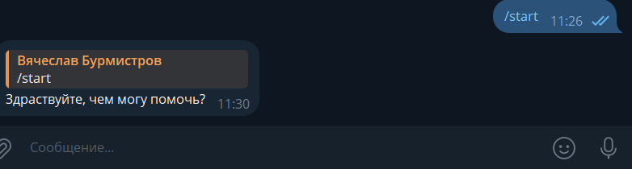
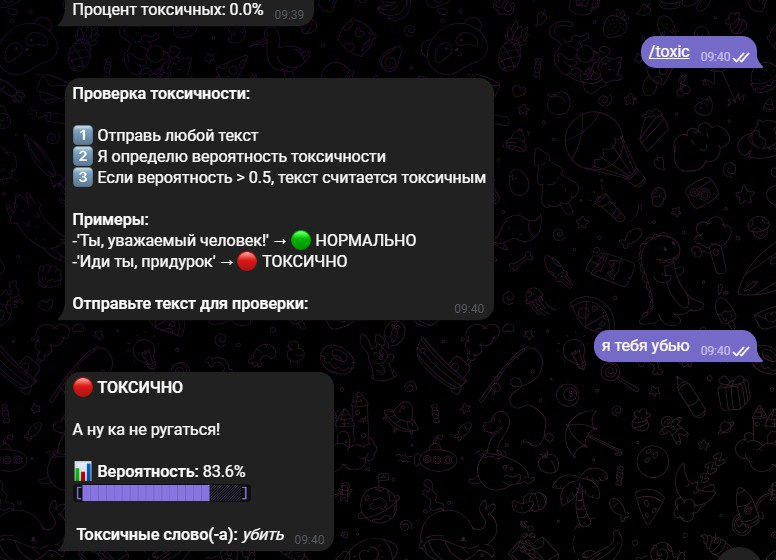
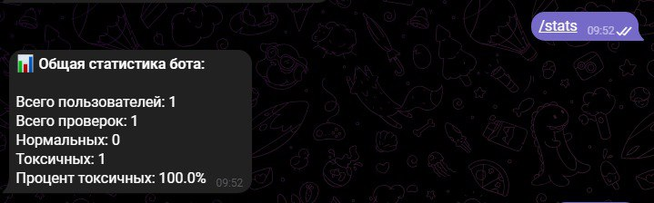
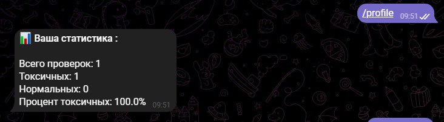

### Название API:
KoboldCPP. Апи развёрнутое на локальной машине. Генерирует вывод.
### Модель ИИ:
Gemma-3-27b-abliterated.q3 - Модель разработанная Google DeepMind.
### Модель трансформатор: mmprojl:
включает компьютерное "зрение" модели

Использование системы контроля Git: Подтверждаю