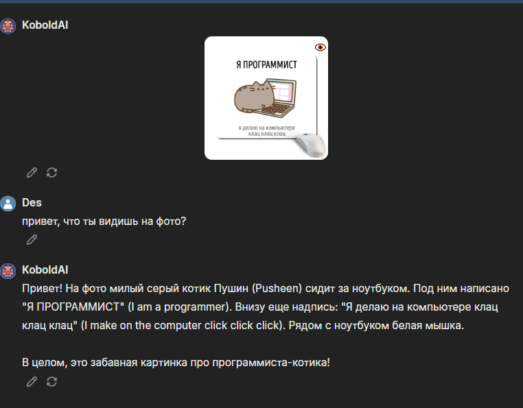

# 🤖 Telegram AI & Toxicity Bot

Интеллектуальный Telegram-бот, сочетающий в себе возможности генеративного ИИ и инструмент для анализа эмоциональной окраски сообщений.

## 🚀 Функциональные возможности

Бот работает в двух специализированных режимах:
1.  **🤖 Режим ИИ (LLM):** Интеллектуальный собеседник, способный поддерживать диалог, отвечать на вопросы и помогать с задачами.

2.  **☣️ Режим анализа токсичности:** Автоматическое определение уровня агрессии и токсичности в текстовых сообщениях.

## 🧠 Технологический стек

### Backend & API
*   **Ядро:** [KoboldCPP](https://github.com/LostRuins/koboldcpp) — развернут локально для обеспечения приватности и высокой скорости генерации.
*   **Интерфейс API:** Локальный API-интерфейс для обработки запросов.

### Модели
*   **Текстовая Модель:** `Gemma-3-27b-abliterated.q4` — мощная модель от Google DeepMind, оптимизированная для свободного общения (abliterated).
*   **Компонент Зрения:** `mmproj` — мультимодальный проектор, позволяющий модели "видеть" и анализировать присланные изображения (Computer Vision).

## 🛠 Технические детали
Бот использует возможности мультимодального зрения, что позволяет пользователям отправлять не только текст, но и изображения для анализа контента.

